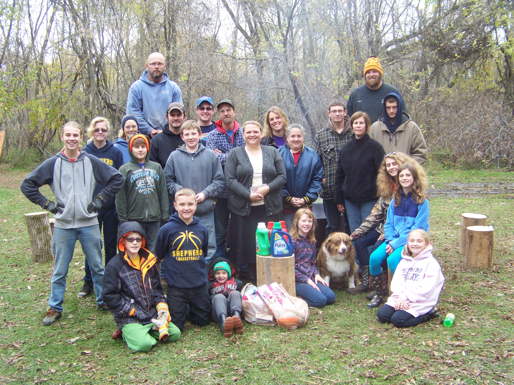
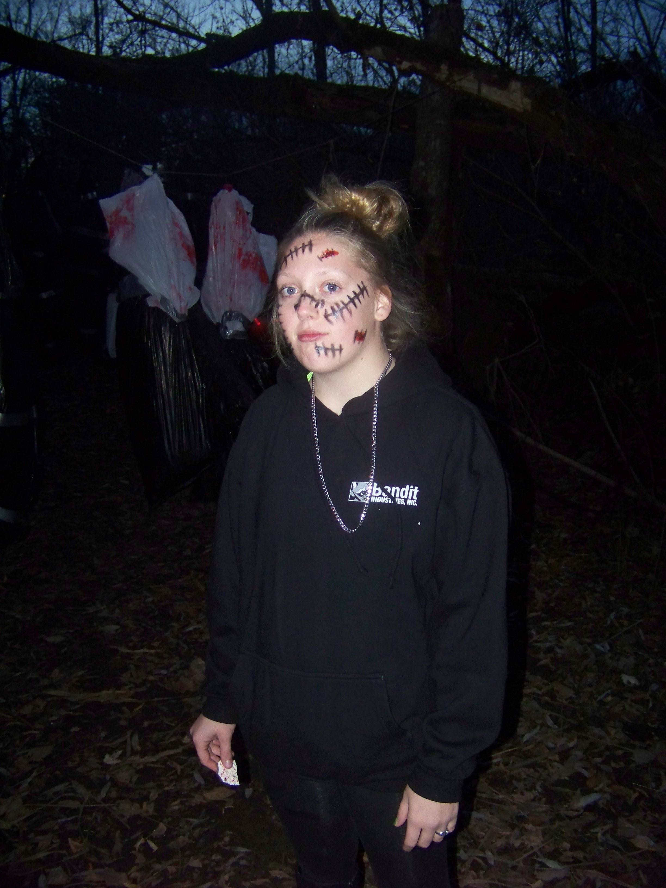
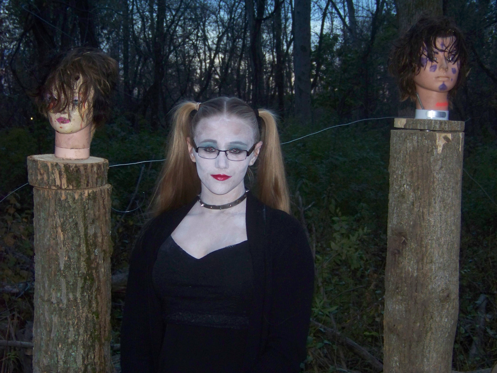
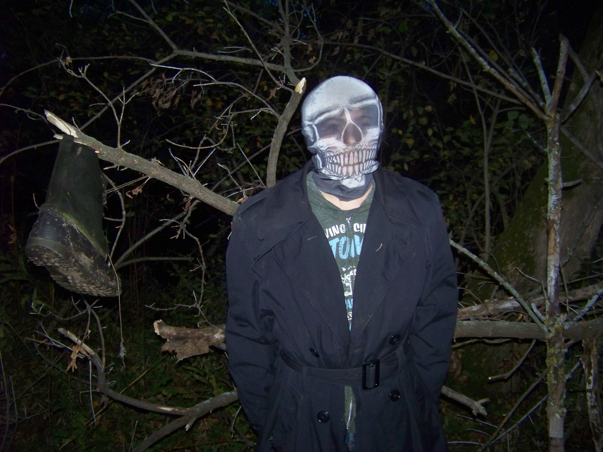
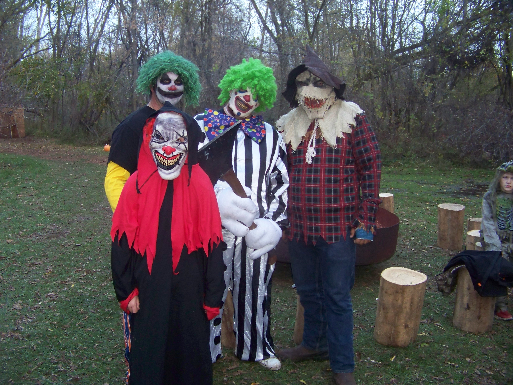
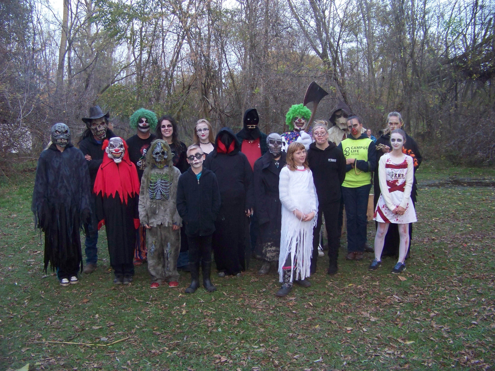
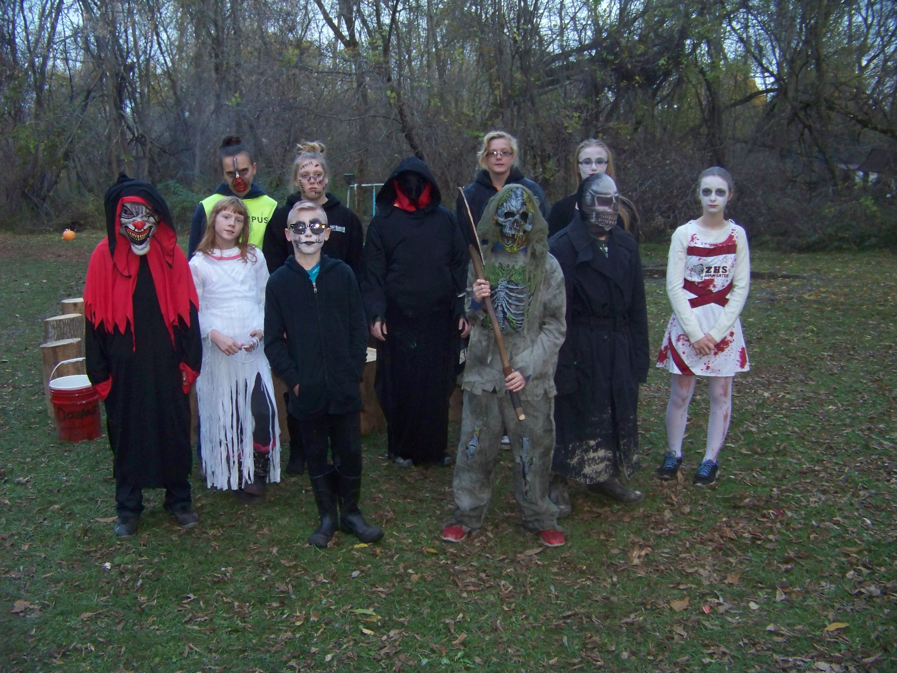

# Haunted Forest thrilled Community during weekend before Halloween

The Haunted Forest returned this year just in time for Halloween. The public was invited to tour the “Haunted Forest” on Thursday, Friday, and Saturday evenings. Consisting entirely of volunteers who decorate the woods and set up scare stations, this was the fifth year that the Haunted Forest has been in operation.

“Everyone from the Shepherd Haunted Forest would like to say thank you for another great year! This was our 5th year doing it and we hope everyone had a great time,” Shannon Wilcox, one of the organizers, said in a post on her Facebook page. “We had a total of 403 guest for all 3 nights and with your help we were able to donate $271.50 along with these items to Fosters Closet of Isabella Co. hope to see everyone back next year!”

On Sunday, October 30, Holly Watson, branch manager for Foster Closet, visited the Haunted Forest group to accept a check and pick up the items which had been collected over the weekend.

Here is the group that made it all happen:

